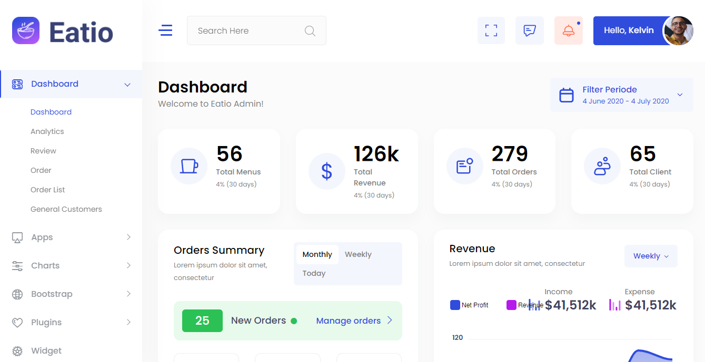

# Eatio-Bootstrap-Dashboard


>Eatio- Restaurant Food Order Bootstrap Admin Dashboard

<!-- [![NPM Version][npm-image]][npm-url]
[![Build Status][travis-image]][travis-url]
[![Downloads Stats][npm-downloads]][npm-url] -->

Eatio is a Free Bootstrap Restaurant Admin Template which will help you to speed up your project and design your own dashboard UI. Users will love it.



## Installation

This section guides you to install all required software and libraries in order to fully utilize Eatio for your project


### Install Node.js
Node.js® is a JavaScript runtime built on Chrome's V8 JavaScript engine. Node.js is required in order to run the Davur build tools. Download the latest version of Node and install it: nodejs.org/en/download/


### Update your NPM
Npm is the package manager for JavaScript and the world’s largest software registry. Npm is a separate project from Node.js, and tends to update more frequently. As a result, even if you’ve just downloaded Node.js (and therefore npm), you’ll probably need to update your npm.

```sh
npm install --global npm@latest
```

### Install all dependencies
If you want to update or develop this theme, you need to install all dependencies by running:
Windows:

```sh
npm install
```

## Folder Directories -
1. css
2. icons
3. images
4. js
5. scss
6. vendor
7. index.html
8. app-calender.html
9. ...

## Plugins included 
[amcharts](https://www.amcharts.com)
[aos](https://michalsnik.github.io/aos)
[apexchart](https://apexcharts.com)
[bootstrap](https://getbootstrap.com)
[bootstrap4-notify](http://bootstrap-notify.remabledesigns.com)
[bootstrap-daterangepicker](https://www.daterangepicker.com)
[bootstrap-material-datetimepicker](https://t00rk.github.io/bootstrap-material-datetimepicker)
[bootstrap-multiselect](https://github.com/davidstutz/bootstrap-multiselect)
[bootstrap-select](https://developer.snapappointments.com/bootstrap-select)
[bootstrap-tagsinput](https://bootstrap-tagsinput.github.io/bootstrap-tagsinput/examples)
[bootstrap-touchspin](https://www.virtuosoft.eu/code/bootstrap-touchspin)
[bootstrap-v4-rtl](https://bootstrap.rtlcss.com)
[chart.js](https://www.chartjs.org)
[chartist](https://gionkunz.github.io/chartist-js)
[chartist-plugin-tooltips](https://github.com/tmmdata/chartist-plugin-tooltip)
[clockpicker](https://weareoutman.github.io/clockpicker)
[datatables](https://datatables.net)
[dropzone](https://www.dropzonejs.com)
[flot](https://www.flotcharts.org)
[flot-spline](https://github.com/miloszfalinski/jquery.flot.spline)
[fullcalendar](https://fullcalendar.io)
[highlightjs](https://highlightjs.org)


## Creator

Kelvin Conrad – [@YourTwitter](https://twitter.com/Klvnconrad) – YourEmail@example.com


## Contributing

1. Fork it (<https://github.com/kelvinconrad/Eatio-Bootstrap-Dashboard/fork>)
2. Create your feature branch (`git checkout -b my-new-feature`)
3. Commit your changes (`git commit -am 'Add some feature'`)
4. Push to the branch (`git push origin my-new-feature`)
5. Create a new Pull Request
